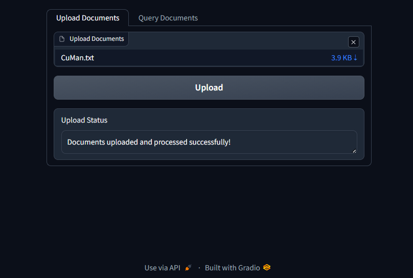
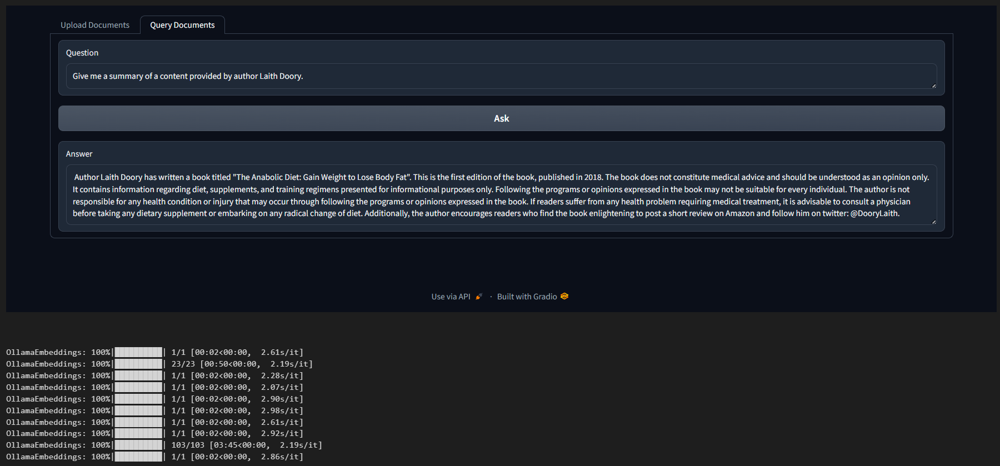
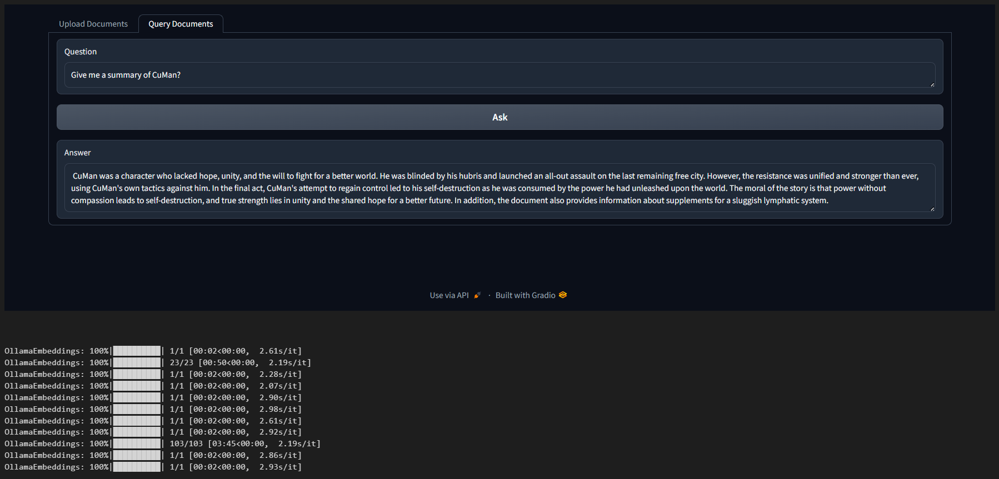

# RAG-based-document-Q&A-System

RAG based system using Python, Gradio, and LangChain to enable real-time, context-driven answers from uploaded documents. Leveraged Chroma, Ollama embeddings, and ChatOllama to optimize document analysis, enhancing business decision-making through efficient information retrieval.
 

